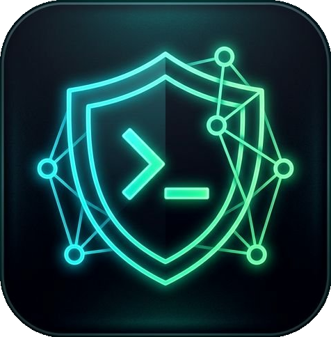
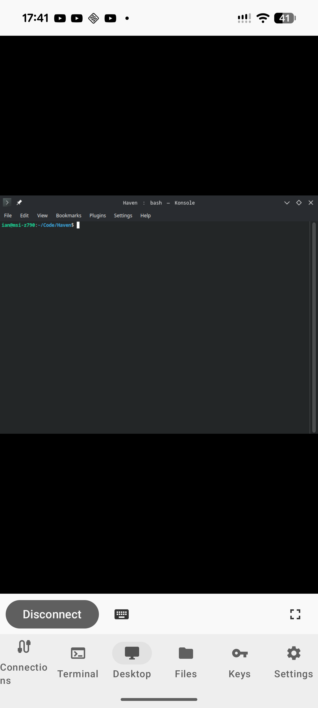

<p align="center">
  
</p>

<h1 align="center">HavenX</h1>

<p align="center">
  Free SSH, VNC, RDP &amp; SFTP client for Android
</p>

<p align="center">
  English | <a href="README.zh-CN.md">简体中文</a>
</p>

<p align="center">
  <a href="https://github.com/hension-code/HavenX/releases/latest"></a>
  <a href="https://github.com/hension-code/HavenX/actions/workflows/ci.yml"></a>
  <a href="LICENSE"></a>
</p>

<p align="center">
  <a href="https://github.com/hension-code/HavenX/releases/latest">GitHub Releases</a>
</p>

---

## Upstream Attribution

This repository is derived from [GlassOnTin/Haven](https://github.com/GlassOnTin/Haven), licensed under [GPLv3](LICENSE).

Original copyright and license notices are retained. This fork includes additional modifications maintained by `hension-code` for HavenX.

<p align="center">
  
  &nbsp;
  
  &nbsp;
  
  &nbsp;
  
  &nbsp;
  
  &nbsp;
  
  &nbsp;
  
  &nbsp;
  
</p>

---

## Features

**Terminal** — VT100/xterm emulator with multi-tab sessions, [Mosh](https://mosh.org) (Mobile Shell) for roaming connections and [Eternal Terminal](https://eternalterminal.dev) (ET) for persistent sessions — both with pure Kotlin protocol implementations (no native binaries), tmux/zellij/screen auto-attach, mouse mode for TUI apps, configurable keyboard toolbar (Esc, Tab, Ctrl, Alt, AltGr, arrows with key repeat), text selection with copy and Open URL, configurable font size, and six color schemes.

**Desktop (VNC)** — Remote desktop viewer with RFB 3.8 protocol support. Pinch-to-zoom, two-finger pan and scroll, single-finger drag for window management, soft keyboard with X11 KeySym mapping. Fullscreen mode with NoMachine-style corner hotspot for session controls. Connect directly or tunnel through SSH. Supports Raw, CopyRect, RRE, Hextile, and ZLib encodings.

**Desktop (RDP)** — Remote Desktop Protocol client built on [IronRDP](https://github.com/Devolutions/IronRDP) via UniFFI Kotlin bindings. Connects to Windows Remote Desktop, xrdp (Linux), and GNOME Remote Desktop. Pinch-to-zoom, pan, keyboard with scancode mapping, mouse input. SSH tunnel support with auto-connect through saved SSH profiles. Saved connection profiles with optional stored password.

**SFTP** — Browse remote directories, upload and download files, delete, copy path, toggle hidden files, sort by name/size/date, and multi-server tabs.

**SSH Keys** — Generate Ed25519, RSA, and ECDSA keys on-device. Import keys from file (PEM/OpenSSH format). One-tap public key copy and deploy key dialog for `authorized_keys` setup. Assign specific keys to individual connections.

**Connections** — Saved profiles with transport selection (SSH, Mosh, Eternal Terminal, VNC, RDP, Reticulum), host key TOFU verification, fingerprint change detection, auto-reconnect with backoff, password fallback, local/remote port forwarding (-L/-R), ProxyJump multi-hop tunneling (-J) with tree view, and RDP-over-SSH tunnel profiles.

**Reticulum** — Connect over [Reticulum](https://reticulum.network) mesh networks via [rnsh](https://github.com/acehoss/rnsh) or [Sideband](https://github.com/markqvist/Sideband) with announce-based destination discovery and hop count.

**Security** — Biometric app lock with configurable timeout (immediate/30s/1m/5m/never), no telemetry or analytics, local storage only. See [PRIVACY_POLICY.md](PRIVACY_POLICY.md).

<details>
<summary><strong>OSC escape sequences</strong></summary>

Remote programs can interact with Android through standard terminal escape sequences:

| OSC | Function | Example |
|-----|----------|---------|
| 52 | Set clipboard | `printf '\e]52;c;%s\a' "$(echo -n text \| base64)"` |
| 8 | Hyperlinks | `printf '\e]8;;https://example.com\aClick\e]8;;\a'` |
| 9 | Notification | `printf '\e]9;Build complete\a'` |
| 777 | Notification (with title) | `printf '\e]777;notify;CI;Pipeline green\a'` |
| 7 | Working directory | `printf '\e]7;file:///home/user\a'` |

Notifications appear as a toast in the foreground or as an Android notification in the background.

</details>

## Install

| Channel | |
|---|---|
| [GitHub Releases](https://github.com/hension-code/HavenX/releases/latest) | Free, signed APK |

### Build from source

```bash
git clone https://github.com/hension-code/HavenX.git
cd HavenX
./gradlew assembleDebug
```

Output: `app/build/outputs/apk/debug/haven-*-debug.apk`

## License

[GPLv3](LICENSE)
